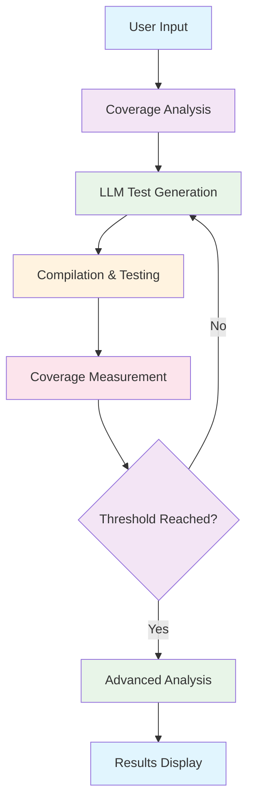

# Major-Project-2
Mentor - Mr. Pawan Mishra
Name
1. Prathmesh Shukla 221B275
2. Manas Singh 221B226
3. Priyanshu Jain 221B282

# Problem Statement
A CLI tool that compiles C++ code with coverage, runs tests, identifies uncovered statements, asks an LLM to generate inputs, and iteratively improves statement coverage.

## Prerequisites
- Python 3.10+
- GCC toolchain (`g++`, `gcov`) available in PATH
- LLVM/Clang (for CFG extraction via libclang)
- Graphviz (`dot`) (for CFG SVG rendering)
- A valid Gemini key in `GOOGLE_API_KEY` (or `GEMINI_API_KEY`)

## Setup
```bash
python -m venv .venv
```

Linux/macOS:
```bash
source venv/bin/activate
export GOOGLE_API_KEY='gemini-api-key'
```

Windows PowerShell:
```powershell
.venv\Scripts\activate
$env:GOOGLE_API_KEY='gemini-api-key'
```

Install dependencies:
```bash
pip install -r requirements.txt
```

If CFG shows `python clang bindings not installed`, install deps again and ensure `libclang` is discoverable:
```bash
pip install clang
```

On macOS with Homebrew, you may need:
```bash
export LIBCLANG_PATH="$(brew --prefix llvm)/lib"
```

## Run
```bash
python -m cli.main --source samples/math_ops.cpp --max-iters 5
python -m cli.main --source samples/advanced_logic.cpp --max-iters 3
python -m cli.main --source samples/complex.cpp --max-iters 1
```

# Line coverage with 80% threshold
python -m cli.main --source samples/math_ops.cpp --coverage-threshold 80.0

# Branch coverage
python -m cli.main --source samples/math_ops.cpp --coverage-type branch

# Function coverage with 50% threshold
python -m cli.main --source samples/math_ops.cpp --coverage-type function --coverage-threshold 50.0

# Architecture
The optimization loop is orchestrated with LangGraph (`core/loop.py`). The graph executes:
1) generate current test file,
2) compile,
3) run tests,
4) parse coverage,
5) stop or ask the LLM for another test,
6) advance iteration and repeat.

## Notes
- On Windows, the runner automatically resolves `.exe` binaries produced by `g++`.

# AI-Powered C++ Test Coverage Optimizer

<div align="center">

[](https://python.org)
[](LICENSE)
[](https://github.com)
[](https://github.com)

*An intelligent C++ test coverage optimization tool that leverages AI to automatically generate comprehensive test cases and maximize code coverage.*

</div>

## Table of Contents

- [Features](#-features)
- [Architecture](#-architecture)
- [Quick Start](#-quick-start)
- [Installation](#-installation)
- [Configuration](#-configuration)
- [Usage](#-usage)
- [Web Interface](#-web-interface)
- [Advanced Analysis](#-advanced-analysis)
- [Development](#-development)
- [Performance](#-performance)
- [Contributing](#-contributing)
- [License](#-license)

---

## Features

### Core Functionality
- **AI-Powered Test Generation**: Leverages Google Gemini to generate intelligent test cases
- **Multi-Type Coverage Support**: Line, Branch, and Function coverage analysis
- **Iterative Optimization**: Automatically improves coverage through multiple iterations
- **Threshold-Based Stopping**: Configurable coverage thresholds (default: 80%)

### Advanced Analysis
- **Code Complexity Analysis**: Cyclomatic, Cognitive, and Maintainability metrics
- **Code Smell Detection**: Identifies long methods, magic numbers, complex code
- **Mutation Testing**: Validates test quality through code mutation
- **Test Quality Scoring**: Comprehensive scoring across multiple dimensions
- **Interactive Visualizations**: Heatmaps, radar charts, and progress tracking

### Web Interface
- **Modern UI**: Built with Flask, TailwindCSS, and Chart.js
- **Responsive Design**: Works seamlessly on desktop and mobile
- **Real-time Updates**: Live progress tracking during optimization
- **Rich Visualizations**: Interactive charts and detailed analytics
- **Code Exploration**: Syntax-highlighted code with coverage indicators

---

## Architecture

<div align="center">



</div>

### Optimization Loop
1. **Coverage Analysis**: Parse existing coverage using `gcov`
2. **Target Identification**: Identify uncovered lines/branches/functions
3. **AI Generation**: LLM generates test cases for uncovered code
4. **Compilation**: Compile tests with existing source
5. **Execution**: Run tests and measure new coverage
6. **Progress Check**: Evaluate if threshold is reached
7. **Iteration**: Repeat until coverage target achieved

### Analysis Pipeline
- **Code Analysis**: Complexity metrics, dependency extraction
- **Quality Assessment**: Test readability, maintainability, performance
- **Mutation Testing**: Code mutation for test validation
- **Reporting**: Comprehensive HTML reports with visualizations

---

## Quick Start

### One-Command Setup
```bash
git clone https://github.com/your-org/Major-project-2.git
cd Major-Project-2
chmod +x setup.sh && ./setup.sh
```

### Run Immediately
```bash
# Basic line coverage optimization
python -m cli.main --source samples/math_ops.cpp

# Branch coverage with custom threshold
python -m cli.main --source samples/complex.cpp --coverage-type branch --coverage-threshold 90

# Start web interface
python web/app.py
```

---

## Installation

### System Requirements

| Requirement | Minimum | Recommended |
|-------------|-----------|-------------|
| Python | 3.10+ | 3.11+ |
| GCC | 9.0+ | 11.0+ |
| LLVM/Clang | 14.0+ | 16.0+ |
| Memory | 4GB | 8GB+ |
| Storage | 2GB | 5GB+ |

### Dependencies Installation

#### Linux/macOS
```bash
# Clone and setup
git clone https://github.com/your-org/major-project-2.git
cd Major-Project-2

# Create virtual environment
python3 -m venv venv
source venv/bin/activate

# Install dependencies
pip install -r requirements.txt

# Setup environment
export GOOGLE_API_KEY='your-gemini-api-key'
export LIBCLANG_PATH="$(brew --prefix llvm)/lib"  # macOS only
```

#### Windows
```powershell
# Clone and setup
git clone https://github.com/your-org/major-project-2.git
cd Major-Project-2

# Create virtual environment
python -m venv venv
venv\Scripts\activate

# Install dependencies
pip install -r requirements.txt

# Setup environment
$env:GOOGLE_API_KEY='your-gemini-api-key'
```

### Verifying Installation

```bash
# Check all dependencies
python -m cli.main --help

# Test with sample
python -m cli.main --source samples/math_ops.cpp --max-iters 1

# Verify web interface
python web/app.py  # Should start on http://localhost:5003
```

---

## Configuration

### Environment Variables

| Variable | Description | Required | Default |
|----------|-------------|-----------|----------|
| `GOOGLE_API_KEY` | Gemini API key for test generation | | - |
| `GEMINI_API_KEY` | Alternative to GOOGLE_API_KEY | | - |
| `LIBCLANG_PATH` | Path to libclang library | | Auto-detected |
| `COVERAGE_TIMEOUT` | Test execution timeout (seconds) | | 30 |
| `MAX_ITERATIONS` | Maximum optimization iterations | | 10 |

### Configuration Files

Create `.env.local` in project root:
```bash
# API Configuration
GOOGLE_API_KEY=your-gemini-api-key-here

# Performance Tuning
MAX_ITERATIONS=15
COVERAGE_TIMEOUT=60

# Analysis Options
ENABLE_MUTATION_TESTING=true
ENABLE_CODE_ANALYSIS=true
COVERAGE_THRESHOLD=85.0
```

---

## Usage

### Command Line Interface

#### Basic Usage
```bash
# Simple line coverage (default 80% threshold)
python -m cli.main --source samples/math_ops.cpp

# Custom threshold
python -m cli.main --source samples/advanced_logic.cpp --coverage-threshold 90.0

# Limited iterations
python -m cli.main --source samples/complex.cpp --max-iters 5
```

#### Coverage Types
```bash
# Line coverage (default)
python -m cli.main --source samples/math_ops.cpp --coverage-type line

# Branch coverage
python -m cli.main --source samples/math_ops.cpp --coverage-type branch

# Function coverage
python -m cli.main --source samples/math_ops.cpp --coverage-type function
```

#### Advanced Options
```bash
# Custom working directory
python -m cli.main --source samples/math_ops.cpp --work-dir ./custom_run

# Verbose output
python -m cli.main --source samples/math_ops.cpp --verbose

# Generate CFG visualization
python -m cli.main --source samples/complex.cpp --generate-cfg
```

### Web Interface

#### Starting the Server
```bash
# Development mode
python web/app.py

# Production mode
export FLASK_ENV=production
python web/app.py --port 80 --host 0.0.0.0
```

#### Using the Web UI
1. **Access**: Open `http://localhost:5003`
2. **Upload**: Select and upload your C++ file
3. **Configure**: Set coverage type and threshold
4. **Optimize**: Click "Start Optimization"
5. **Monitor**: Watch real-time progress
6. **Analyze**: View detailed results and visualizations

---

## Advanced Analysis

### Code Quality Metrics

| Metric | Description | Impact |
|---------|-------------|---------|
| **Cyclomatic Complexity** | Decision points in code | High = Harder to test |
| **Cognitive Complexity** | Mental effort to understand | High = Harder to maintain |
| **Maintainability Index** | Overall code maintainability | Low = Needs refactoring |
| **Code Smells** | Anti-patterns in code | Reduces quality |

### Mutation Testing

- **Mutation Operators**: AOR, ROR, LCR, etc.
- **Mutation Score**: Percentage of killed mutations
- **Quality Validation**: Tests effectiveness measurement
- **Performance**: Limited mutations for speed

### Test Quality Scoring

| Dimension | Weight | Factors |
|-----------|---------|---------|
| **Coverage** | 30% | Line, branch, function coverage |
| **Readability** | 25% | Function naming, comments, structure |
| **Maintainability** | 20% | Code complexity, duplication |
| **Performance** | 15% | Execution time, memory usage |
| **Robustness** | 10% | Error handling, edge cases |

---

## Development

### Project Structure

```
Major-Project-2/
├── cli/                 # Command-line interface
├── core/                # Core optimization logic
├── coverage/            # Coverage analysis tools
├── llm/                 # LLM integration
├── analysis/            # Advanced analysis modules
├── web/                 # Web interface
├── samples/             # Sample C++ files
├── tests/               # Test suite
└── reports/             # Generated reports
```

### Testing

```bash
# Run all tests
python -m pytest tests/

# Run specific test
python -m pytest tests/test_coverage.py -v

# Coverage for tests
python -m pytest tests/ --cov=. --cov-report=html
```

### Building

```bash
# Development build
python -m build

# Production build
python -m build --release

# Create distribution
python -m build --wheel
```

---

## Performance

### Benchmarks

| Metric | Value | Description |
|--------|--------|-------------|
| **Average Optimization Time** | 2-5 minutes | For 1000-line files |
| **Coverage Improvement** | 20-40% | Over baseline coverage |
| **Memory Usage** | <500MB | During optimization |
| **LLM API Calls** | 5-15 | Per optimization run |

### Optimization Strategies

- **Smart Targeting**: Focus on high-impact uncovered lines
- **Early Termination**: Stop when threshold reached
- **Incremental Building**: Reuse existing tests
- **AI Guidance**: LLM chooses optimal test cases

---

## Contributing

We welcome contributions! Please see our [Contributing Guide](CONTRIBUTING.md) for details.

### Getting Started

1. **Fork** the repository
2. **Clone** your fork locally
3. **Setup** development environment
4. **Create** feature branch
5. **Make** your changes
6. **Test** thoroughly
7. **Submit** pull request

### Development Guidelines

- **Follow** existing code style and patterns
- **Add** tests for new features
- **Update** documentation as needed
- **Ensure** all tests pass
- **Keep** changes focused and minimal

### Bug Reports

Please report bugs using our [issue template](.github/ISSUE_TEMPLATE/bug_report.md):

- **Description**: Clear and concise
- **Steps to reproduce**: Detailed reproduction steps
- **Environment**: OS, Python version, etc.
- **Expected vs Actual**: What should happen vs what happens

---

## License

This project is licensed under the MIT License - see the [LICENSE](LICENSE) file for details.

<div align="center">

**Made with by the Major-Project-2 Team**

[](https://github.com/your-org/major-project-2)
[](https://github.com/your-org/major-project-2)
[](https://github.com/your-org/major-project-2/issues)

</div>
